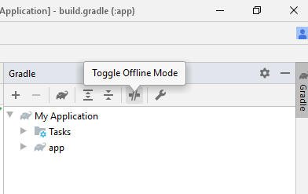

# Koneksi Internet Terbatas
Jika koneksi internetmu terbatas, kamu bisa menggunakan materi belajar berbasis non-video dan mengkonfigurasi Gradle di Android Studio.

## Materi Belajar
Kursus _Developing Android Apps with Kotlin_ dari Udacity mungkin terasa berat, karena materi belajarnya berbasis video. Untuk itu kamu bisa menggunakan materi belajar alternatif yang berbasis non-video ini: [Android Kotlin Fundamentals CodeLabs](https://codelabs.developers.google.com/android-kotlin-fundamentals/).

Materi yang ada di CodeLabs ini kurang lebih sama dengan yang di Udacity. Jadi tidak masalah meskipun kamu belajarnya dari situ.

## Konfigurasi Gradle di Android Studio
Starter code atau project apapun yang ada di materi belajar kemungkinan besar menggunakan versi Gradle yang berbeda dengan versi Gradle yang tersedia di komputer/laptopmu. Jika ini terjadi, Android Studio akan otomatis mendownload versi Gradle yang diperlukan. Di satu sisi, ini akan memudahkan karena kamu tidak perlu melakukan apapun, dan project bisa langsung terbuka. Namun, jika koneksi internetmu terbatas, ini bisa menjadi masalah.

Oleh sebab itu, sebelum membuka project di Android Studio, kita perlu mengkonfigurasi projectnya agar **menggunakan versi Gradle yang sama** dengan yang ada di komputer/laptopmu. Langkah pengerjaannya ada tiga sebagai berikut.

### Bagian #1: Cari Tahu Versi Gradle Kamu
Langkah ini cukup kamu kerjakan sekali. Namun jika kamu mengganti versi Android Studio atau Android SDK, kamu harus melakukan langkah ini lagi.
1. Buat project baru di Android Studio, dan pastikan project tersebut dapat dijalankan di HP atau emulator.
2. Buka `build.gradle` yang ada di folder project, lalu cari baris berikut. Catat versi Kotlin dan Gradle yang kamu punya.
```gradle
buildscript {
    ext.kotlin_version = '1.3.70'
    ...
    dependencies {
        classpath 'com.android.tools.build:gradle:3.6.0'
        ...
    }
}
```
3. Buka `gradle-wrapper.properties` yang ada di folder \gradle\wrapper, lalu cari baris berikut. Catat versi Gradle yang kamu punya.
```
distributionUrl=https\://services.gradle.org/distributions/gradle-5.6.4-all.zip
```
4. Buka `build.gradle` yang ada di folder \app, lalu cari baris berikut. Catat versi Android SDK yang kamu punya.
```gradle
android {
    compileSdkVersion 29
    buildToolsVersion "29.0.3"
   ...
}
```
5. Jika `buildToolsVersion` di langkah 4 tidak ada, kamu bisa mencarinya dengan cara:
  * Buka menu File > Settings
  * Buka Appearance & Behavior > System Settings > Android SDK.
  * Perhatikan bagian atasnya, ada 3 tab, pilih yang SDK Tools.
  * Centang Show Package Details di bagian kanan bawah.
  * Catat versi build tools terbaru yang statusnya terinstall.
6. (Opsional) Kamu juga bisa mencatat versi dependencies yang kamu punya di `build.gradle` yang ada di folder \app. Namun karena dependencies ini ukurannya tidak signifikan, kamu bisa lewati langkah ini.
```gradle
dependencies {
    implementation fileTree(dir: 'libs', include: ['*.jar'])
    implementation "org.jetbrains.kotlin:kotlin-stdlib-jdk7:$kotlin_version"
    implementation 'androidx.appcompat:appcompat:1.1.0'
    implementation 'androidx.core:core-ktx:1.2.0'
    implementation 'androidx.constraintlayout:constraintlayout:1.1.3'
    testImplementation 'junit:junit:4.12'
    androidTestImplementation 'androidx.test.ext:junit:1.1.1'
    androidTestImplementation 'androidx.test.espresso:espresso-core:3.2.0'
}
```

### Bagian #2: Atur Project yang Akan Dibuka
Lakukan langkah-langkah berikut **menggunakan Notepad++** atau text editor lainnya SEBELUM membuka project Android Studio. Langkah-langkah ini hanya perlu dilakukan sekali untuk setiap project.
1. Buka `build.gradle` yang ada di folder project, lalu sesuaikan versi Kotlin dan Gradle seperti yang kamu punya di langkah 2 bagian #1.
2. Buka `gradle-wrapper.properties` yang ada di folder \gradle\wrapper, lalu sesuaikan versi Gradle seperti yang kamu punya di langkah 3 bagian #1.
3. Buka `build.gradle` yang ada di folder \app, lalu sesuaikan versi Android SDK seperti yang kamu punya di langkah 4-5 bagian #1.
4. (Opsional) Jika kamu melakukan langkah 6 bagian #1, sesuaikan versi dependencies seperti yang kamu punya.
5. Simpan semua file yang telah kamu ubah, lalu buka project di Android Studio. Jika kamu melakukannya dengan benar, Android Studio tidak akan menggunakan internet yang besar lagi.

### Bagian #3: Gunakan Gradle Mode Offline
Setelah project berhasil dibuka, cobalah untuk menjalankan project tersebut di HP atau emulator. Jika project telah berjalan sempurna, kamu bisa mengaktifkan mode offline di Gradle, sehingga Gradle tidak akan menggunakan internet sama sekali. Caranya dengan membuka panel Gradle di sebelah kanan Android Studio, lalu klik Toggle Offline Mode.



---
Ada pertanyaan? Pengen diskusi? Silahkan membuat issue baru. **Mention** dosen kelasmu dan/atau asprak agar segera mendapat jawaban.